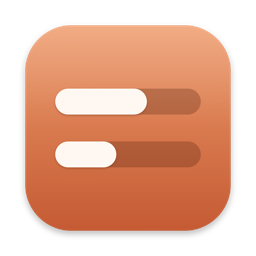
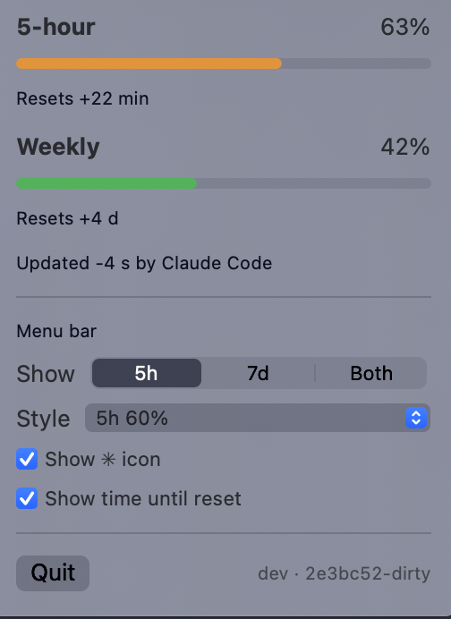

<p align="center">
  
</p>

<h1 align="center">UsageBar</h1>

<p align="center">
  A macOS menu bar app that shows your Claude subscription usage: the 5-hour and weekly limits.<br>
  No passwords, cookies or API keys. No network access, Keychain, or Accessibility permission.
</p>

<p align="center">
  
</p>

## Requirements

- macOS 13 or later, Apple Silicon or Intel.
- [Claude Code](https://docs.claude.com/en/docs/claude-code), signed in with a **Claude Pro or Max** plan
  (`/login`). Usage limits aren't reported when Claude Code uses an API key, Bedrock or Vertex.

## Install

1. Download `UsageBar-<version>-macos-universal.zip` from the
   [latest release](https://github.com/johnlofty/claude-bar/releases/latest), unzip it, and move
   `UsageBar.app` to `/Applications`.
2. Open it. The app is ad-hoc signed, not notarized, so macOS blocks the first launch. Go to
   **System Settings → Privacy & Security**, scroll down, and click **Open Anyway** next to UsageBar.
   Or run this once in Terminal:

   ```sh
   xattr -dr com.apple.quarantine /Applications/UsageBar.app
   ```
3. Click the ✳︎ in the menu bar, then **Connect**.
4. Send a prompt in Claude Code. Start a new session if one was already open. Your usage appears within
   a few seconds.

To start it at login, add it under **System Settings → General → Login Items**.

## How it works

```
Claude Code ──status line JSON──▶ usagebar-hook ──▶ ~/.claude/usage-bar.json ──▶ UsageBar (menu bar)
                                       │
                                       └──▶ your own status line command, output passed back unchanged
```

Claude Code runs a [status line](https://docs.claude.com/en/docs/claude-code/statusline) command after
each reply and passes it JSON on stdin. For subscribers, that JSON includes `rate_limits`: the used
percentage and reset time of the 5-hour and weekly windows. UsageBar never asks Claude for anything; it
only picks up what Claude Code already has.

**Connect** does three things:

1. Copies a small helper, `usagebar-hook`, into `~/.claude/usagebar/`. It lives outside the app bundle,
   so the status line keeps working if the app is moved or deleted.
2. Saves your current status line setting to `~/.claude/usagebar/config.json`, and backs up
   `~/.claude/settings.json` to `~/.claude/settings.json.usagebar-backup`.
3. Sets `statusLine.command` in `~/.claude/settings.json` to the helper. Your other settings, including
   status line options such as `padding`, are left alone.

Each time Claude Code runs the helper, it:

- saves only the two windows' `used_percentage` and `resets_at`, plus a timestamp, to
  `~/.claude/usage-bar.json`. Nothing else from the status line input, such as paths or session IDs, is
  written;
- records in `~/.claude/usagebar/last-run.json` that it ran and whether limits were present. The app uses
  this to tell "waiting for Claude Code" apart from "Claude Code isn't reporting limits";
- runs your previous status line command with the same input and prints its output, so your status line
  looks exactly as before. If you had none, it prints nothing.

The app checks `~/.claude/usage-bar.json` every few seconds. It needs no permissions and makes no
network requests.

**Disconnect** puts your original `statusLine` setting back and removes `~/.claude/usagebar/`.

## Display options

The popover lets you choose:

- **Show:** 5h, 7d, or both.
- **Style:** `5h 60%`, `60%`, mini bars, or bars + %.
- **Show ✳︎ icon:** the icon always comes first in the menu bar.
- **Show time until reset:** for example `5h 60% (2h)`.

The footer shows the build version and commit, for example `v0.1.0 · 2e3bc52`.

## Troubleshooting

| The popover says | What to do |
|---|---|
| Connect to Claude Code | Click **Connect**. |
| Waiting for Claude Code | Send a prompt in Claude Code. Sessions that were already open may need restarting to pick up the new status line. |
| No usage limits reported | Claude Code ran the helper but sent no limits. Sign in with a Pro or Max plan (`/login`) instead of an API key, and update Claude Code. |
| Error about `settings.json` | The file isn't valid JSON, so UsageBar didn't change it. Fix the file and click **Connect** again. |

Numbers only update while Claude Code is running. Usage on claude.ai counts toward the same limits, but
it shows up the next time Claude Code refreshes. A window whose reset time has passed shows `–` until new
data arrives.

## Manual setup

If you'd rather wire it up yourself, pipe the status line input to `scripts/usage-snapshot.sh` (needs
`jq`). Put this in your status line script, right after it reads stdin into `input`:

```sh
echo "$input" | sh /path/to/claude-bar/scripts/usage-snapshot.sh
```

## Development

```sh
sh scripts/build-app.sh          # build/UsageBar.app for this Mac's architecture
UNIVERSAL=1 sh scripts/build-app.sh   # arm64 + x86_64, needs full Xcode
sh scripts/make-icon.sh          # regenerate the icon from scripts/make-icon.swift
```

The project has two targets. `UsageBar` is the SwiftUI menu bar app, and
`Sources/UsageBar/ClaudeSetup.swift` handles Connect and Disconnect. `UsageBarHook` is the status line
helper, which uses only Foundation so it starts quickly.

## Releases

Every merged pull request publishes a GitHub release with a zipped, universal, ad-hoc signed
`UsageBar.app`. The PR's label picks the version bump:

| Label | Bump |
|---|---|
| `release:major` | v1.4.2 → v2.0.0 |
| `release:minor` | v1.4.2 → v1.5.0 |
| _(none)_ | v1.4.2 → v1.4.3 |
| `release:skip` | no release |

Direct pushes to `main` don't release. Pushing a `v*` tag by hand releases that tag.
